# Week 3 Lab Report

## Simplest Search Engine Code

```
import java.io.IOException;
import java.net.URI;

class Handler implements URLHandler {
  String stringPool[] = new String[100];
  int size = 0;

  public String handleRequest(URI url) {
    if (url.getPath().equals("/")) {
      String stringList = "List of strings:\n\n";

      for (int idx = 0; idx < size; idx++) {
        stringList += stringPool[idx] + '\n';
      }

      return stringList;
    }
    else {
      System.out.println("Path: " + url.getPath());

      if (url.getPath().contains("/add")) {
        String parameters[] = url.getQuery().split("=");

        if (parameters[0].equals("s")) { // paramters[0] is the left side of the '='
          stringPool[size] = parameters[1];
          size++;

          return String.format("New string added: %s\n", parameters[1]);
        }
      }
      else if (url.getPath().contains("/search")) {
        String parameters[] = url.getQuery().split("=");

        if (parameters[0].equals("s")) {
          String query = parameters[1];
          String foundStrings = "Here's what we found for the search term: "
              + query + "\n\n";

          for (int idx = 0; idx < size; idx++) {
            if (stringPool[idx].contains(query)) {
              foundStrings += stringPool[idx] + '\n';
            }
          }

          return foundStrings;
        }
      }

      return "404 Not Found!";
    }
  }
}

class SearchEngine {
  public static void main(String[] args) throws IOException {
    if (args.length == 0){
      System.out.println("Missing port number! Try any number between 1024 to 49151");
      return;
    }

    int port = Integer.parseInt(args[0]);

    Server.start(port, new Handler());
  }
}
```

## Using Simplest Search Engine

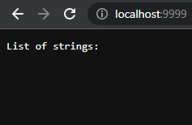

The above screenshot shows the page at the root directory before any strings are added. When the server starts, the `main` method is called that takes in the port number inputted (in this case, 9999). Inside the `handleRequest` method in class `Handler`, the `equals` method is called that checks if the URL path is equal to "`/`", which it is in this case.

During the URL in the screenshot is typed in, there is no path specified, meaning that it defaults to the root path "`/`" which returns a list of all the strings in stringPool, an array of strings. Since we have not added any strings, the list of strings is empty.

Let's add a string.

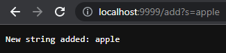

Again, the `equals` method is called to check if the path is "`/`", but here it is not. So, it checked if the path contained "`add`", which it did since we specified that in the URL path. The method then created the string array `parameters` containing the query with the "`s`" to the left of the equal sign in `parameters[0]` and the word (in this case, apple) to the right of the equal sign in `parameters[1]`. This was done using the `split` method. Because `parameters[0]` equals "`s`" (using the `equals` method), `parameters[1]` was added into the `stringPool`
array, and the `size` variable was incremented.

Returning to the root page now shows this:

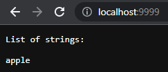

Adding a couple more strings gives us this:

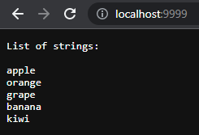

Let's try searching for words containing the substring "`an`" in `stringPool` by setting the path to "`/search`" instead of "`/add`" as we did earlier.

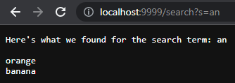

Like in the previous screenshots, `equals` and `contains` is used to check if the path is equal to "`/`" or has the path "`/search`", and `split` is used to split the URL query into two parts. The method then uses `contains` again when looping through `stringPool` to see if it contains the search term in `parameters[1]`, returning a new array of strings called `foundStrings`.

---

## Bug Fixing

Failure-inducing input:

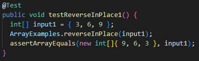

Symptom:

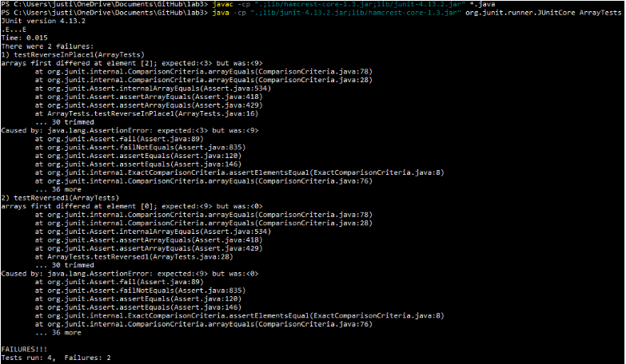

Bug corrected:

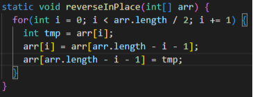

Originally, the code looped through the full array and set each element to its respective element on the other side of the array. This caused a bug in which elements from the first to the middle element were replaced by the ones at the end but were not saved somehow, so when the algorithm got to the last half of the elements, they would just be replaced by themselves. Thus, when I tried the failure-inducing input `{ 3, 6, 9 }` expecting to get `{ 9, 6, 3 }`, I really got `{ 9, 6, 9 }`. I fixed this bug by only looping halfway and doing swaps instead of just setting one element to another.

---

Failure-inducing input:

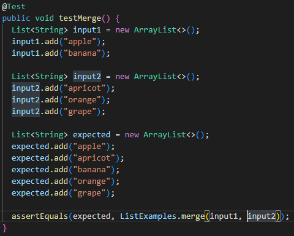

Symptom:

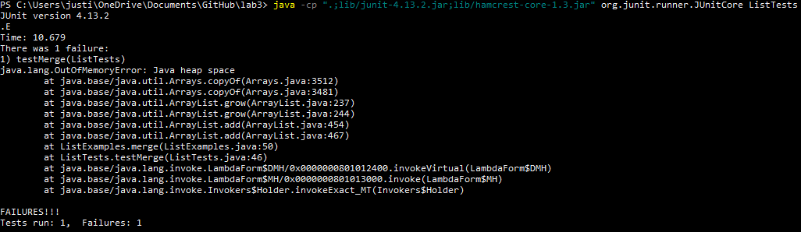

Bug corrected:

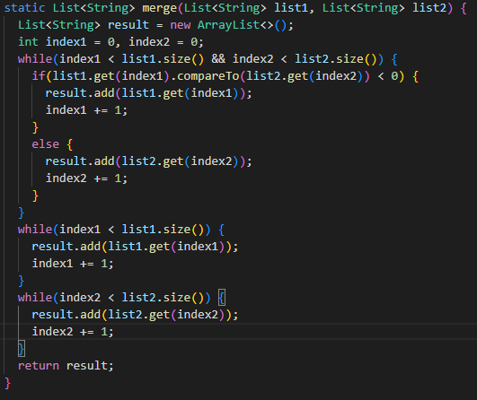

Here, the bug was that in the last while loop, the variable incremented was `index1` instead of `index2`. This caused an infinite loop because it continued to try to add the next elements of `input2` of the failure-inducing input since `index1` was being incremented while `index2` was being checked.
