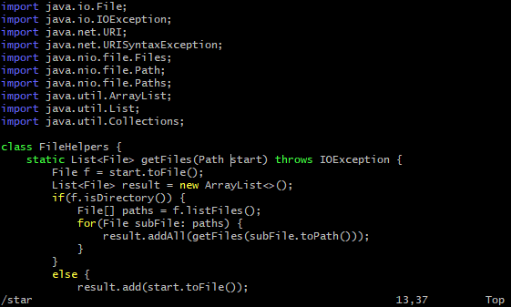
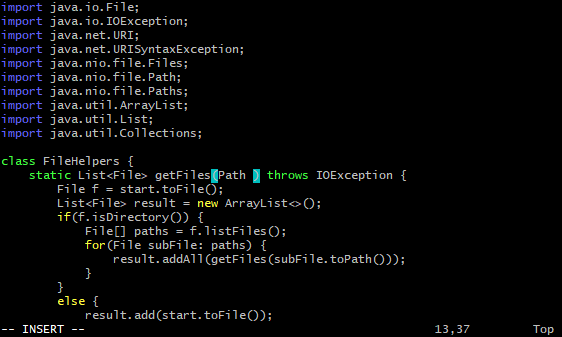
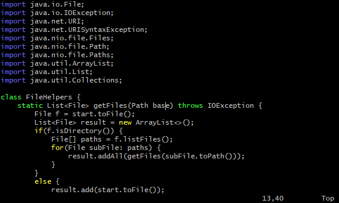
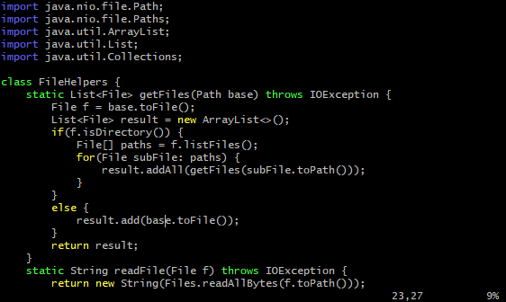
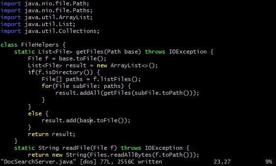

# Week 7 Lab Report - Vim

## Changing the name of the `start` parameter and its uses to `base` in `DocSearchServer.java`:

`/star<Enter>cebase<Esc>n.n.:w<Enter>`

---

`/star<Enter>`

The `/` allows us to search for a pattern; in this case, we search for `start` since that is the word we are trying to replace. However, just typing `star` is sufficient to bring the cursor to the correct location at the beginning of the word `start` in the `getFiles` function signature. Pressing `<Enter>` then finalizes what we are searching for and returns us to normal mode.

---

`ce`

`c` stands for change. After typing `c`, we type `e` so that it deletes from the cursor to the end of the word, effectively removing `start`. `c` also puts us in insert mode after typing in the cursor movement command (in this case, `e`) so that we can replace `start` with whatever we want.

---

`base<Esc>`

Since we are in insert mode, we type `base` into where `start` once was. Then, we press `<Esc>` to return to normal mode.

---

`n.`

Next, we type `n` which goes to the next occurrence of `star` since vim still remembers that we are looking for that pattern. This moves the cursor one line down to the beginning of `start`. Pressing `.` causes vim to repeat the last change to the file done, and that is `cebase<Esc>`. Notice that it doesn't repeat the last command, but the last actual change to the file. You cannot repeat movement commands using this command. Folloinwg `n.`, the second `start` is now replaced by `base`.

---

`n.` (_again_)

Now, we type `n.` again so that we move the cursor to the beginning of the third `start` and it is replaced with `base`.

---

`:w`

Lastly, as we are in normal mode, we type `:w` which writes the changes we made so that they are saved.

---

---
