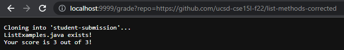
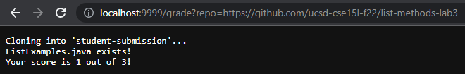
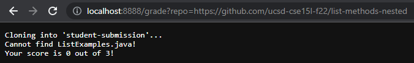

# Week 9 Lab Report - Grade Server

## `grade.sh` file
```
set -e

rm -rf student-submission
git clone $1 student-submission
cd student-submission/
FILE=ListExamples.java

if [[ -f "$FILE" ]]
then
        echo "ListExamples.java exists!"
else
        echo "Cannot find ListExamples.java!"
        echo "Your score is 0 out of 3!"
        exit
fi

cp ../TestListExamples.java ./

set +e

SCORE=0

javac -cp ".;../lib/*" ListExamples.java TestListExamples.java

if [[ $? -eq 0 ]]
then
  SCORE=$(($SCORE+1))
else
  echo "Your score is" $SCORE "out of 3!"
  exit
fi

FAILED=$(java -cp ".;../lib/*" org.junit.runner.JUnitCore TestListExamples | grep -oP "(?<=,  Failures: )[0-9]+")

if [[ $? -eq 1 ]] # passed all tests
then
  SCORE=$(($SCORE+2))
else
  SCORE=$(($SCORE+2-$FAILED))
fi

echo "Your score is" $SCORE "out of 3!"
```

---

## list-methods-**corrected**



## list-methods-**lab3**



## list-methods-**nested**



---

## list-methods-**nested** (trace)

```
set -e
```
return code: 0

```
rm -rf student-submission
```
return code: 0

```
git clone $1 student-submission
```
stderr: Cloning into 'student-submission'...

return code: 0

```
cd student-submission/
```
return code: 0

```
FILE=ListExamples.java
```
return code: 0

```
if [[ -f "$FILE" ]]
```
FALSE because `ListExamples.java` does not exist in the current directory.

```
then
        echo "ListExamples.java exists!"
```
not run

```
else
        echo "Cannot find ListExamples.java!"
        echo "Your score is 0 out of 3!"
        exit
fi
```
stdout: Cannot find ListExamples.java

stdout: Your score is 0 out of 3!

return code: 0

```
cp ../TestListExamples.java ./

set +e

SCORE=0

javac -cp ".;../lib/*" ListExamples.java TestListExamples.java

if [[ $? -eq 0 ]]
then
  SCORE=$(($SCORE+1))
else
  echo "Your score is" $SCORE "out of 3!"
  exit
fi

FAILED=$(java -cp ".;../lib/*" org.junit.runner.JUnitCore TestListExamples | grep -oP "(?<=,  Failures: )[0-9]+")

if [[ $? -eq 1 ]] # passed all tests
then
  SCORE=$(($SCORE+2))
else
  SCORE=$(($SCORE+2-$FAILED))
fi

echo "Your score is" $SCORE "out of 3!"
```
not run