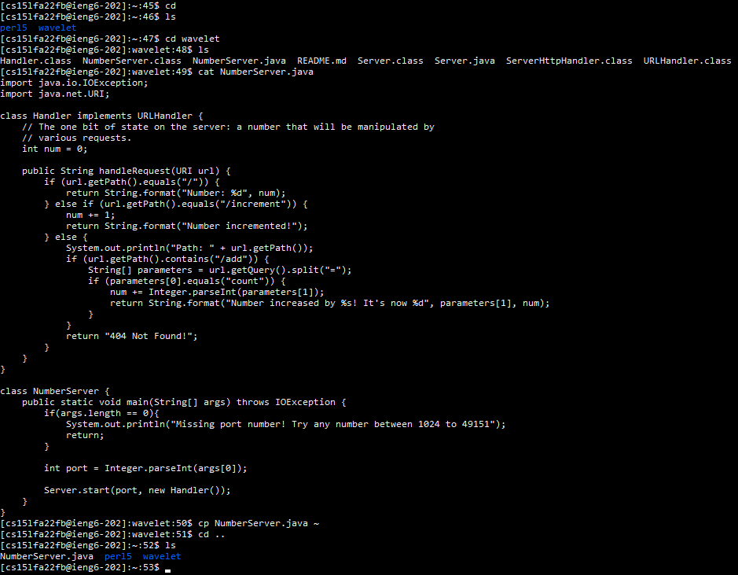

# Week 1 Lab Report

This is a tutorial on how to remotely access the `ieng6` computers at UCSD from anywhere using your CSE15L account.

## Installing VSCode

Go to https://code.visualstudio.com/ and click the **Download** button for your operating system.


## Remotely Connecting

Check if the ssh command is recognized by your system command prompt.

If not, install the [OpenSSH Client](https://learn.microsoft.com/en-us/windows-server/administration/openssh/openssh_install_firstuse?tabs=gui).

In my case, I already had OpenSSH installed and was able to use the ssh command.

Next, open up the terminal in VS Code or use Windows PowerShell and type in:

> `ssh cs15lfa22zz@ieng6.ucsd.edu`

However, replace the 'zz' characters with your specific CSE15L login which you can find [here](https://sdacs.ucsd.edu/~icc/index.php).

Enter your password. If it does not work, follow [this tutorial](https://docs.google.com/document/d/1hs7CyQeh-MdUfM9uv99i8tqfneos6Y8bDU0uhn1wqho/edit) to reset it.

Since my password never worked and resetting did not work for me, I only have a screenshot of what a failed attempt to login in looks like.


## Trying Some Commands

Now that you are remotely logged in, here are a several commands you can run:

- `cd`
- `ls`
- `cp`
- `cat`

`cd` allows you to change your current directory to whatever directory you type in. Putting a tilde instead of an address takes you to your home directory.

`ls` lists out all files in the current directory.

`cp` copies a file or groups of files and takes in two or more parameters

`cat` outputs the contents of the file you type the name of. You can output multiple files by simply appending more file names to the end.

To logout, use the `exit` command.

Here is a screenshot of some of the commands being used.


## Moving Files with scp

Create a file named `WhereAmI.java` and paste this code inside it.

```
class WhereAmI {
  public static void main(String[] args) {
    System.out.println(System.getProperty("os.name"));
    System.out.println(System.getProperty("user.name"));
    System.out.println(System.getProperty("user.home"));
    System.out.println(System.getProperty("user.dir"));
  }
}
```

Run this code using the `javac` and `java` commands.

To copy this file over to `ieng6`, use the `scp` command, meaning secure copy.

> `scp WhereAmI.java cs15lfa22zz@ieng6.ucsd.edu:~/`

Remember to replace 'zz' with your corresponding login.

It should then ask for your password, but since it does not work for me, here is a screenshot of a failed `scp` command.

Note that the passphrase will not appear as you type it.

Now, this file should appear on the remote server, and you can run the same `javac` and `java` commands there.

## Setting an SSH Key

To avoid having to type in our password when logging in or using `scp` every time, we can use `ssh` keys instead. Follow this screenshot to generate your pair of files containing the public and private keys.


Log into the server and create a `.ssh` directory, then return to your client and `scp` the file containing the public key over to the `.ssh` file in the server.

Following these steps will allow you to use `ssh` and `scp` without having to enter your password each time.

## Optimizing Remote Running

Here are two shortcuts to remote running that can make the process of running commands and copying files easier.

1. Add a command in double quotes at the end of the ssh command to run a command on the remote server using less steps.
   > `ssh cs15lfa22@ieng6.ucsd.edu "ls"`
2. Chain multiple commands together by inserting semi-colons between each command.
   > `cp WhereAmI.java OtherMain.java; javac OtherMain.java; java WhereAmI`
